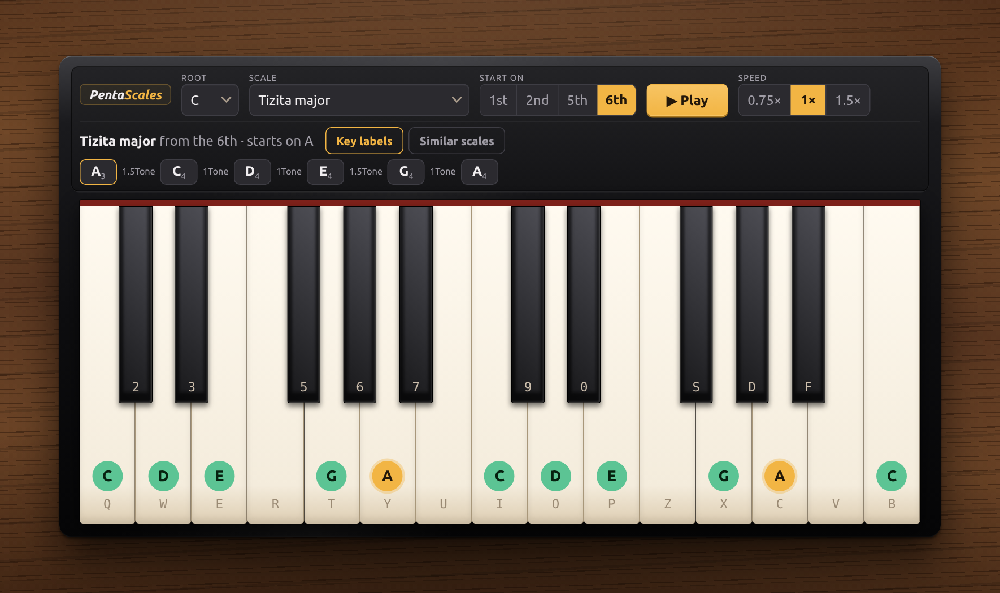
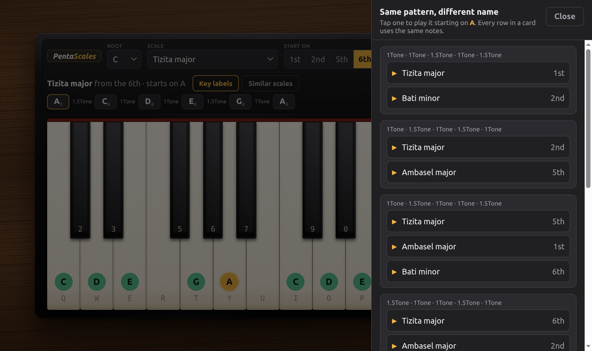

# 🎹 PentaScales

**An interactive piano for learning the Ethiopian pentatonic scales — and hearing how they turn into one another.**



---

## 💡 The idea

Ethiopian music is built on a handful of pentatonic modes — *qeñet* — with names like **Tizita**, **Bati**, **Ambasel** and **Anchi hoye lene**. Each is five notes, and each carries its own character. *Tizita* means nostalgia, and the scale named after it is the one you'll recognise from a hundred Ethiopian songs.

Here's the part that makes them fun to study: **start the same five notes from a different place and you get a different mode entirely.**

Play Tizita major from C and you get `C D E G A`. Start those same notes from the 6th — from A — and you're playing `A C D E G A`, which is **Bati minor**. Same keys. Same pattern. Different name, different feeling.

PentaScales lets you hear that. Pick a root, pick a scale, pick where to start, and press Play.

## 🔄 Same pattern, different name

The **Similar scales** drawer computes every one of these overlaps for you. It rotates all 7 scales through all 4 starting positions, groups them by their interval pattern, and shows you which ones collide.



Tap any row and it loads that scale onto the note you're already sitting on — so you can hear, back to back, that two differently-named scales are the same handful of notes.

## ✨ What's in it

| | |
|---|---|
| 🎼 **7 scales** | Tizita, Ambasel and Bati in major and minor, plus Anchi hoye lene |
| 🔑 **All 12 roots** | transpose any scale to any key |
| 🔄 **4 starting positions** | 1st, 2nd, 5th and 6th |
| 🎹 **Real piano samples** | two octaves, C3–C5 |
| 👆 **Playable** | mouse, multi-touch chords, glissando, or your computer keyboard |
| ▶️ **Scale runs** | plays up and back down, at three speeds |
| 📱 **Built for phones** | landscape-first, no scrolling, no zooming |

### ⌨️ Playing from the computer keyboard

```
white keys   Q W E R T Y U   I O P Z X C V   B
black keys    2 3   5 6 7     9 0   S D F
```

Hold several at once for chords. Click and drag across the keys for a glissando.

---

## 🛠️ Under the hood

### 🔢 The music is just integers

Every scale is five semitone steps. That's the whole model:

```js
{ id: 'TIZITA-1', label: 'Tizita major', steps: [2, 2, 3, 2, 3] }
{ id: 'BATI-2',   label: 'Bati minor',   steps: [3, 2, 2, 3, 2] }
```

Starting from a different position is a **rotation** of that array — which is exactly why the equivalences fall out for free. Rotate Tizita major by four and you get `[3, 2, 2, 3, 2]`, which *is* Bati minor.

`src/music/` knows nothing about React and nothing about audio. It's pure functions over integers, which is why the test suite runs in about a second with no DOM and no sound card.

One subtlety worth knowing: the start positions are labelled **1st, 2nd, 5th, 6th** — these are *diatonic* degree names read off the major pentatonic frame (Tizita major is `C D E G A`, so G is the 5th and A the 6th). The label names the position, not the index, and it stays with that position across every scale.

### 🔊 Sound: decode once, schedule precisely

The 25 samples are fetched and decoded into Web Audio `AudioBuffer`s once at startup, so pressing a key costs nothing but wiring up a buffer source. Notes get a short attack and a gentle release, a retriggered note fades under its replacement, and everything runs through a compressor so chords and fast runs don't clip.

Scale runs are **scheduled on the audio clock**, not with `setTimeout`:

```js
const t0 = getContext().currentTime + LEAD
events.forEach(({ step, time }) => {
    noteOn(notes[keys[step]].name, t0 + time)   // sample-accurate
    later(() => highlight(step), LEAD + time)   // visual, best-effort
})
```

Timing is therefore immune to whatever the main thread is doing. If the browser stutters, the highlight lags — the music doesn't.

Samples load in parallel with the UI, middle octave first, and each key lights up as its sample becomes playable. A file that fails to load is reported and skipped rather than blocking the rest.

### 👆 Input

The keyboard has **one** set of pointer handlers on the container, not two per key. It hit-tests with `elementFromPoint` and tracks a `Map` of `pointerId → note`, which is what gives you multi-touch chords and glissando without any extra machinery. The computer keyboard is a single `keydown`/`keyup` pair on `window`, keyed by `KeyboardEvent.code`.

### 📱 Landscape on a phone

A 25-key piano wants to be wide, so the app asks for landscape on the opening tap — fullscreen plus `screen.orientation.lock()` where the browser allows it, a web-app manifest for installed use, and a CSS fallback that rotates the whole interface 90° for browsers (iOS Safari) that can't lock at all. That same tap is what unlocks the `AudioContext`.

The keyboard is sized from its own height at a fixed aspect ratio rather than stretched to fill the viewport, so the keys keep piano proportions on any screen, with the case showing either side as cheek blocks. Key labels scale with container query units.

---

## 🚀 Running it

```bash
npm install
npm run dev        # dev server on http://localhost:3000
npm test           # 20 tests across 3 suites
npm run build      # production bundle into build/
npm run preview    # serve that bundle locally
```

The dev server also binds to your LAN address, so you can open it on a phone on the same network — handy, since the landscape and touch behaviour are the parts you can't check on a desktop.

Built with **Vite**, tested with **Vitest**. The only runtime dependency is React itself — the whole bundle is about **48 kB of JavaScript and 3.5 kB of CSS**, gzipped.

Needs a reasonably current browser: Web Audio, Pointer Events and CSS container queries.

## 📁 Project layout

```
src/
  music/        scale and note theory — pure, tested, no dependencies
  audio/        Web Audio engine: sample loading, voices, scheduling
  hooks/        scale playback, computer-keyboard input
  components/   Keyboard, Toolbar, ScaleReadout, EquivalentScales, StartGate
  lib/          orientation and fullscreen helpers
  sounds/       25 piano samples, C3–C5

index.html      the entry point Vite serves
vite.config.js  build, dev server and test config
```

---

Programmed by **Kaleb Wondwossen Tsegaye** 🇪🇹
